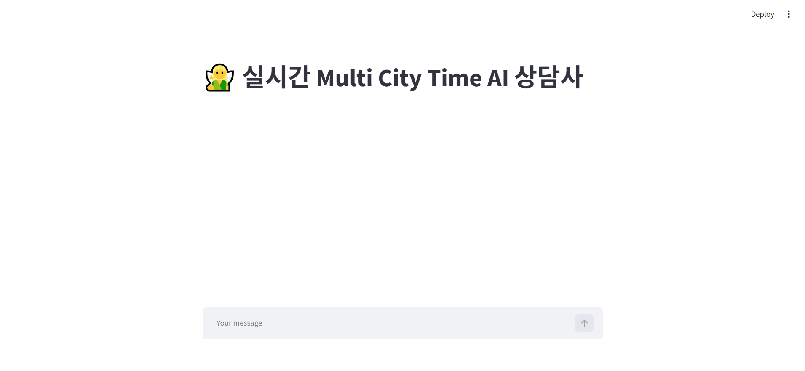

# LLM-Langchain-Practice

- 이 레포는 AI인공지능빅데이터 수업에서 LangChain + OpenAI API + Streamlit을 활용해 진행한 실습 프로젝트 모음입니다!  

   

### 사용 기술 스택
`OpenAI API`, `LangChain`, `Streamlit`  
 

### Featured Projects

| 프로젝트 | 설명 | UI |
|---|---|---|
| [hotel-review-lcel-pipeline](링크) | 리뷰 번역/분석 LCEL 체인 | 없음 (스크립트) |
| [multi-city-time-chat](링크) | 다중 도시 시간 안내 챗봇 | Streamlit |

 

### Demo

**multi-city-time-chat**

